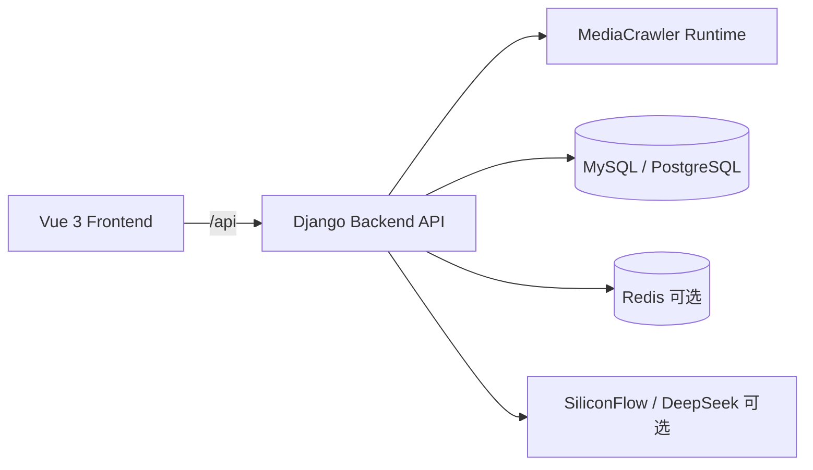

# MediaCrawler 舆情监测平台

基于 MediaCrawler 爬虫能力构建的多平台舆情监测与分析系统，提供数据采集、敏感内容筛选、实时动态聚合、Cookie 管理和 AI 深度分析。仓库同时包含 `Vue 3` 前端、`Django` 后端、爬虫运行目录以及部署脚本，适合作为课程项目、毕设原型或本地研究环境。

## 项目概览

| 模块 | 说明 |
|------|------|
| 前端应用 | 仪表盘、数据采集、深度分析、系统设置四个核心页面 |
| 后端 API | 健康检查、平台配置、爬虫控制、数据查询、Monitor Feed、Cookie 管理、AI 分析 |
| 爬虫运行时 | 集成在 `backend/crawler/`，支持二维码登录或 Cookie 登录 |
| 数据存储 | 默认使用 MySQL，兼容 PostgreSQL，Redis 和 MongoDB 为可选配置 |
| 部署方式 | 提供 `deploy.sh`、`docker-compose.yml` 和独立部署文档 |

## 支持平台

- 小红书 `xhs`
- 抖音 `dy`
- 快手 `ks`
- B站 `bili`
- 微博 `wb`
- 贴吧 `tieba`
- 知乎 `zhihu`

## 功能一览

| 页面 | 路由 | 主要能力 |
|------|------|----------|
| 概览仪表盘 | `/dashboard` | 查看各平台敏感数据分布、实时动态流、平台情绪概览 |
| 数据采集 | `/data` | 切换平台、启动/停止爬虫、查看敏感数据和全量数据、筛选搜索排序 |
| 深度分析 | `/analysis` | 关键词云、事件摘要、风险提示、平台/时间维度情绪图表 |
| 系统设置 | `/settings` | Cookie 配置管理、爬虫配置入口 |

## 技术栈

| 层级 | 技术 |
|------|------|
| 前端 | Vue 3、Vite、Vue Router、Element Plus、ECharts、Axios |
| 后端 | Django 5、Django REST Framework、django-cors-headers |
| 爬虫 | Playwright、MediaCrawler 运行时 |
| 数据 | MySQL、PostgreSQL、Pandas |
| 部署 | Docker Compose、Nginx、`deploy.sh` |

## 架构关系



## 目录结构

```text
MediaCrawler-main/
├── backend/
│   ├── api/                    # API 视图、Cookie/AI 相关逻辑、接口测试
│   ├── crawler/                # 爬虫运行时与平台抓取实现
│   ├── media_platform/         # 各平台数据模型
│   ├── mediacrawler_config/    # Django 配置、路由、设置
│   ├── tests/                  # 后端基础测试
│   ├── .env                    # 唯一环境变量文件
│   ├── README.md               # 后端模块说明
│   └── requirements.txt        # Python 依赖
├── frontend/
│   ├── src/components/         # 通用组件
│   ├── src/layouts/            # 主布局
│   ├── src/router/             # 前端路由
│   ├── src/views/              # 四个核心页面
│   ├── README.md               # 前端模块说明
│   └── package.json            # 前端依赖与脚本
├── deploy.sh                   # 一键部署与运维脚本
├── docker-compose.yml          # 容器编排
├── DEPLOYMENT.md               # 生产部署说明
├── DATA_SOURCE_AUDIT.md        # 数据源核查记录
└── README.md                   # 本文件
```

## 快速开始

### 1. 环境准备

- Python `3.11+`（仓库包含 `.python-version`）
- Node.js（建议 LTS 版本）
- 可选：MySQL / PostgreSQL、Redis、Docker

### 2. 启动后端

```bash
cd backend
python -m venv .venv
source .venv/bin/activate
pip install -r requirements.txt
touch .env
python manage.py migrate
python manage.py runserver 0.0.0.0:8000
```

说明：

- 整个项目只读取 `backend/.env` 这一份环境文件
- 如需启用深度分析，请在 `backend/.env` 中配置 `SILICONFLOW_API_KEY`

### 3. 启动前端

```bash
cd frontend
npm install
npm run dev
```

说明：

- 开发环境下，Vite 已将 `/api` 代理到 `http://127.0.0.1:8000`
- 前端默认访问地址为 `http://127.0.0.1:5173`

### 4. 本地默认入口

| 地址 | 用途 |
|------|------|
| `http://127.0.0.1:5173` | 前端开发页面 |
| `http://127.0.0.1:8000/` | 后端 API 根入口 |
| `http://127.0.0.1:8000/api/health` | 健康检查 |
| `http://127.0.0.1:8000/admin/` | Django Admin |

## API 概览

| 路径 | 方法 | 说明 |
|------|------|------|
| `/api/health` | `GET` | 健康检查 |
| `/api/config/platforms` | `GET` | 获取支持的平台列表 |
| `/api/config/options` | `GET` | 获取前端配置项 |
| `/api/crawler/start` | `POST` | 启动爬虫 |
| `/api/crawler/stop` | `POST` | 停止爬虫 |
| `/api/crawler/status` | `GET` | 查询爬虫状态 |
| `/api/monitor/feed` | `GET` | 获取实时动态流 |
| `/api/monitor/feed/sensitive` | `GET` | 获取敏感动态 |
| `/api/monitor/feed/all` | `GET` | 获取全量动态 |
| `/api/cookies` | `GET` | 查询 Cookie 配置 |
| `/api/ai/analysis` | `POST` | 执行 AI 深度分析 |

完整接口说明见 [backend/README.md](backend/README.md)。

## 部署入口

- 生产部署：见 [DEPLOYMENT.md](DEPLOYMENT.md)
- 数据源核查：见 [DATA_SOURCE_AUDIT.md](DATA_SOURCE_AUDIT.md)
- 后端说明：见 [backend/README.md](backend/README.md)
- 前端说明：见 [frontend/README.md](frontend/README.md)

## 当前工程状态

| 项目 | 当前情况 |
|------|----------|
| 项目级 README | 已补齐，作为 GitHub 首页主说明 |
| API 文档页 | 当前没有 Swagger / OpenAPI 风格的 `/api/docs` 页面 |
| 后端测试 | 仓库中已有少量后端测试文件，自动化覆盖仍然有限 |
| 前端测试 | 当前未发现测试用例 |
| 前端质量脚本 | 目前仅有 `dev`、`build`、`preview`，尚未提供 `lint` / `test` |
| CI 工作流 | 仓库中未发现 `.github/workflows/` |

## 注意事项

- 本项目许可证为 [NON-COMMERCIAL LEARNING LICENSE 1.1](LICENSE)，仅限非商业学习与研究用途。
- 二维码登录、实时爬取和敏感分析结果会受到目标平台页面结构、反爬策略、网络环境和人工登录状态影响。
- 仓库说明以本 README、[backend/README.md](backend/README.md) 以及代码实现为准；当前不存在 `/api/docs` 接口页面。
